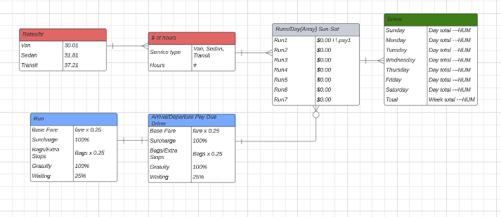

# Payroll-Project
This is a payroll reconcilliation app for a small ground transportation company. At this company drivers are payed by both porition of the run, and/or and hourly rate. Until now this has been calculated manually. Now the payroll admin can input the data from each run, and the program will do the calculations for each run, each day, and each week based on those inputs. Upon sucess of the login functionality, each driver will be able to enter his/her run information as a means of inputing his/her weekly payroll. The driver will also have acess to his/her pay history after logging into their account.

## Wireframe

## ERD

## Technologies Used
- HTML
- CSS
- Javascript
- MongoDB

## Getting Started
### [Wireframe](https://lucid.app/lucidspark/070ef9ad-701f-4db5-89d7-fc0df257b6d8/edit?beaconFlowId=4B9155E629D46088&invitationId=inv_409acb19-f726-4e44-8ce9-c1ccdf1563f9&page=0_0#)

## Stretch Goals
- Messaging functionality upon login
- Login Functionality
- Log weekly pay history
- Ability to search through history by week-ending date
- Dispcrepancy page
- Ability of users to upload images

## Next Steps
- Integrating with the reservation booking site to pull reservation information automatically.
- Store and display messaging history of user upon login.
- A signature page, where the customer can sign, approving any gratuities added in the vehicle, and it will save the data to a certain runId to display on the payroll input page.
